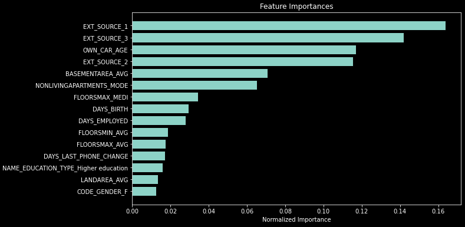

# Quantifik

Code de machine-learning sur une EDA automatisée dans ce [notebook](notebooks/Partie_2_01.ipynb) et la création d'un modèle ainsi que les **Features Importances** dans ce [notebook](notebooks/04.ipynb).

## Modélisation des données

Le modèle utilisé est le [RandomForestClassifier de scikit-learn](https://scikit-learn.org/stable/modules/generated/sklearn.ensemble.RandomForestClassifier.html#sklearn.ensemble.RandomForestClassifier).

## Features Importances

Le code du graphique des feature importances est dans [ce fichier](src/eda.py#L431) :

## Autres exemples

Le dépôt contient d'autres exemples de code venant de sources diverses, pour [différents algorithmes](src/algorithms) ou un code provenant [d'une compétition](src/jsaguiar.py).
